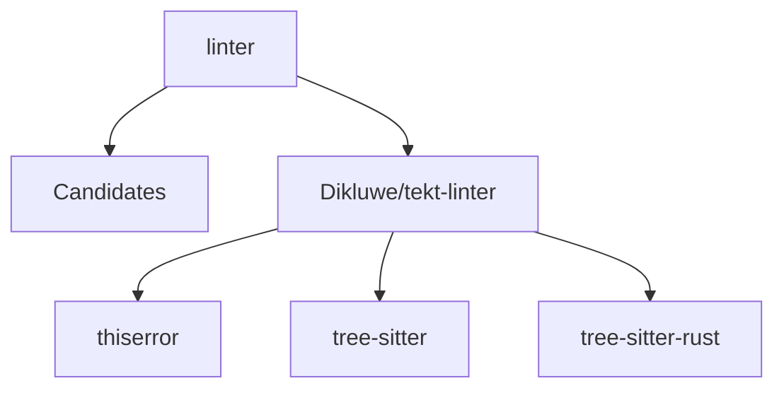

# Relatório de Análise Arquitetural — Bateia

**Query de Busca**: `linter`  
**Linguagem**: `rust`  
**Gerado em**: 2026-08-11 00:02:15 UTC  

## Resumo do Funil de Redução

| Estágio | Quantidade | Observação |
| :--- | :--- | :--- |
| **1. Descoberta (Topo)** | 4 candidatos | Fonte: Sourcegraph (sem consumo de Search API) |
| **2. Triagem (Meio)** | 1 aprovados | Leitura de manifestos e estrutura (3 descartados) |
| **3. Extração (Fundo)** | 1 entregues | Extração idempotente e cacheados por `repo@commit` |

#### ⏱️ Telemetria de Desempenho do Funil

- **Tempo Total de Execução**: `2997 ms`  
- **Tempo de Triagem (Estágio 2)**: `1548 ms`  
- **Tempo de Extração (Estágio 3)**: `1448 ms`  
- **Métricas de Cache**: `0 Hits` / `2 Misses`  

### 📊 Grafo de Dependências (Mermaid.js)



---

## 1. Soluções Exatas Encontradas (Com Rastreabilidade `repo@commit`)

### 1. [Dikluwe/tekt-linter](https://github.com/Dikluwe/tekt-linter)

- **Score de Relevância**: `65/100` (`README_KEYWORD_MATCH`)
- **Saúde Arquitetural**: 💚 `95/100`
- **Justificativa**: Match de 1/1 termos-chave/prefixos no README do repositório
- **Commit Rastreável**: `Dikluwe/tekt-linter`
- **Estrelas**: ⭐ N/A (metadado indisponível)
- **Descrição**: Repositório Injetado (Benchmark)
- **Consultado Em**: 2026-08-11 00:02:17

#### Módulo & Dependências (`Cargo.toml`)
- **Módulo**: `crystalline-lint` (Rust)
- **Principais Dependências Directas**:
  - `thiserror` (1)
  - `tree-sitter` (0.23)
  - `tree-sitter-rust` (0.23)
  - `tree-sitter-typescript` (0.23)
  - `tree-sitter-python` (0.23)

#### ⚠️ Violações Arquiteturais Detectadas (Arch-Linter)

- **[LOW] MISSING_DEVOPS_AUTOMATION**: Nenhum arquivo de automação CI/CD, Dockerfile ou Makefile detectado na raiz do projeto. (alvo: `crystalline-lint`)
```text
  Error: [MISSING_DEVOPS_AUTOMATION]
     ╭─[crystalline-lint:1:1]
  1 │ // Ausência de Dockerfile / Makefile / .github/workflows
     · ^^^^^^^^^^^^^^
     ╰─[Dica: Crie um pipeline de CI/CD (.github/workflows) e Dockerfile para padronizar o build.]
```

#### Arquivos Extraídos

<details><summary><b>README.md</b> (16242 bytes) — <a href="https://github.com/Dikluwe/tekt-linter/blob/main/README.md" target="_blank">Ver no GitHub ↗</a></summary>

```md
# crystalline-lint

> Linter arquitetural para projetos que seguem a [Arquitetura Cristalina](https://github.com/Dikluwe/crystalline-architecture-standard).

Sem este linter, as regras estruturais são sugestões. Com ele,
violações se tornam ruído visível no CI, no editor e no terminal
— antes de virarem dívida técnica.

---

## Instalação

**Via Cargo:**
```bash
cargo install crystalline-lint
```

**Binário para CI (GitHub Releases):**
```bash
curl -sSL https://github.com/Dikluwe/tekt-linter/releases/latest/download/crystalline-lint-linux-x86_64 \
  -o crystalline-lint && chmod +x crystalline-lint
```

---

## Uso rápido

```bash
# Verificar o projeto no diretório atual
crystalline-lint .

# Saída SARIF para GitHub Code Scanning
crystalline-lint --format sarif . > results.sarif

# Corrigir hashes de prompt desatualizados (V5)
crystalline-lint --fix-hashes .

# Atualizar snapshots de interface desatualizados (V6)
crystalline-lint --update-snapshot .


... 📄 [Conteúdo truncado para visualização no relatório. Ver arquivo completo em: https://github.com/Dikluwe/tekt-linter/blob/main/README.md]
```
</details>

<details><summary><b>Cargo.toml</b> (989 bytes) — <a href="https://github.com/Dikluwe/tekt-linter/blob/main/Cargo.toml" target="_blank">Ver no GitHub ↗</a></summary>

```toml
[package]
name = "crystalline-lint"
version = "0.2.0"
edition = "2021"
rust-version = "1.75"
description = "Crystalline Architecture Linter"
repository = "https://github.com/Dikluwe/tekt-linter"
license = "MIT"

[lib]
path = "lib.rs"

[[bin]]
name = "crystalline-lint"
path = "04_wiring/main.rs"

[dependencies]
# L1 — core
thiserror         = "1"

# L3 — infra
tree-sitter            = "0.23"
tree-sitter-rust       = "0.23"
tree-sitter-typescript = "0.23"
tree-sitter-python     = "0.23"
tree-sitter-c          = "0.23"
tree-sitter-cpp        = "0.23"
walkdir           = "2"
sha2              = "0.10"
hex               = "0.4"
serde             = { version = "1", features = ["derive"] }
serde_json        = "1"
toml              = "0.8"

# L2 — shell
clap              = { version = "4", features = ["derive"] }
colored           = "2"

# L4 — wiring (ADR-0004)
rayon             = "1"

... 📄 [Conteúdo truncado para visualização no relatório. Ver arquivo completo em: https://github.com/Dikluwe/tekt-linter/blob/main/Cargo.toml]
```
</details>

<details><summary><b>lib.rs</b> (1082 bytes) — <a href="https://github.com/Dikluwe/tekt-linter/blob/main/lib.rs" target="_blank">Ver no GitHub ↗</a></summary>

```rs
//! Crystalline Lineage
//! @prompt 00_nucleo/prompts/linter-core.md
//! @prompt 00_nucleo/prompts/architecture-standards.md
//! @prompt-hash 44f1f602
//! @layer L0
//! @updated 2026-03-20

// ── L1: Core ─────────────────────────────────────────────────────────────────
#[path = "01_core/entities/mod.rs"]
pub mod entities;

#[path = "01_core/contracts/mod.rs"]
pub mod contracts;

#[path = "01_core/rules/mod.rs"]
pub mod rules;

// ── L3: Infra ─────────────────────────────────────────────────────────────────
#[path = "03_infra/mod.rs"]
pub mod infra;

// ── L2: Shell ────────────────────────────────────────────────────────────────
#[path = "02_shell/mod.rs"]
pub mod shell;
```
</details>

---

## 2. Ideias Alternativas & Abordagens Encontradas

Agrupamento das técnicas identificadas nos repositórios analisados:

- **Dikluwe/tekt-linter**: Principais pacotes/ferramentas: `thiserror, tree-sitter, tree-sitter-rust, tree-sitter-typescript, tree-sitter-python, tree-sitter-c`

## 3. Descobrimento de Necessidades Ocultas

Análise do ecossistema técnico e padrões arquiteturais presentes nos repositórios extraídos:

### 🧪 1. Estratégia de Testes

> Nenhuma ferramenta de teste específica detectada nos manifestos.

### ⚙️ 2. Configuração e Ambiente

| Ferramenta | Repositórios (%) | Repositórios Detectados | Versões Comuns |
| :--- | :--- | :--- | :--- |
| **clap** | 100% (1/1) | Dikluwe/tekt-linter | 4 |

### 🗄️ 3. Banco de Dados e Migrações

> Nenhum driver ou ORM de banco de dados detectado nos manifestos.

### 📊 4. Observabilidade e Comunicação

| Ferramenta | Repositórios (%) | Repositórios Detectados | Versões Comuns |
| :--- | :--- | :--- | :--- |
| **serde** | 100% (1/1) | Dikluwe/tekt-linter | 1 |

### 🔄 5. Automação e DevOps

> Nenhum arquivo padrão de automação/DevOps identificado na estrutura.


---

## 🎯 4. Matriz Ontológica & Score de Similaridade de Ideia (0-100%)

### 📊 Distribuição de Projetos por Ecossistema / Linguagem

| Ecossistema | Repositórios Encontrados | Distribuição (%) | Maior Score de Similaridade | Estrelas Médias | Tecnologias Dominantes |
| :--- | :--- | :--- | :--- | :--- | :--- |
| **Rust 🦀** | 1 repos | `100%` | `80%` | ⭐ N/A (metadado indisponível) | `sha2, hex, clap` |

**Domínio Alvo Analisado**: `(Benchmark) System`  
**Palavras-Chave de Intenção**: `(benchmark), injetado, linter, repositório, tekt`  

| Repositório Candidato | Score Geral | Classificação | Intenção (Vet1) | Stack (Vet2) | Capacidades (Vet4) | Termos em Comum |
| :--- | :--- | :--- | :--- | :--- | :--- | :--- |
| **Dikluwe/tekt-linter** | 🟢 **80%** | `Identical / Core Twin Idea` | 100% | 100% | 0% | `(benchmark), injetado, linter, repositório, tekt` |

### 💡 Recomendações de Melhoria Derivadas de Projetos Semelhantes

| Categoria | Recomendações e Melhorias Propostas | Taxa de Adoção | Projetos de Referência | Justificativa Ontológica |
| :--- | :--- | :--- | :--- | :--- |
| **General Library** | Adotar 'tree-sitter-cpp' para fortalecer a infraestrutura | `100%` | `Dikluwe/tekt-linter` | 100% dos repositórios ontologicamente parecidos utilizam 'tree-sitter-cpp'. |
| **General Library** | Adotar 'walkdir' para fortalecer a infraestrutura | `100%` | `Dikluwe/tekt-linter` | 100% dos repositórios ontologicamente parecidos utilizam 'walkdir'. |
| **General Library** | Adotar 'serde_json' para fortalecer a infraestrutura | `100%` | `Dikluwe/tekt-linter` | 100% dos repositórios ontologicamente parecidos utilizam 'serde_json'. |
| **General Library** | Adotar 'clap' para fortalecer a infraestrutura | `100%` | `Dikluwe/tekt-linter` | 100% dos repositórios ontologicamente parecidos utilizam 'clap'. |
| **General Library** | Adotar 'rayon' para fortalecer a infraestrutura | `100%` | `Dikluwe/tekt-linter` | 100% dos repositórios ontologicamente parecidos utilizam 'rayon'. |
| **General Library** | Adotar 'thiserror' para fortalecer a infraestrutura | `100%` | `Dikluwe/tekt-linter` | 100% dos repositórios ontologicamente parecidos utilizam 'thiserror'. |
| **General Library** | Adotar 'tree-sitter-python' para fortalecer a infraestrutura | `100%` | `Dikluwe/tekt-linter` | 100% dos repositórios ontologicamente parecidos utilizam 'tree-sitter-python'. |
| **General Library** | Adotar 'serde' para fortalecer a infraestrutura | `100%` | `Dikluwe/tekt-linter` | 100% dos repositórios ontologicamente parecidos utilizam 'serde'. |
| **General Library** | Adotar 'colored' para fortalecer a infraestrutura | `100%` | `Dikluwe/tekt-linter` | 100% dos repositórios ontologicamente parecidos utilizam 'colored'. |
| **General Library** | Adotar 'tree-sitter-go' para fortalecer a infraestrutura | `100%` | `Dikluwe/tekt-linter` | 100% dos repositórios ontologicamente parecidos utilizam 'tree-sitter-go'. |
| **General Library** | Adotar 'tempfile' para fortalecer a infraestrutura | `100%` | `Dikluwe/tekt-linter` | 100% dos repositórios ontologicamente parecidos utilizam 'tempfile'. |
| **General Library** | Adotar 'tree-sitter' para fortalecer a infraestrutura | `100%` | `Dikluwe/tekt-linter` | 100% dos repositórios ontologicamente parecidos utilizam 'tree-sitter'. |
| **General Library** | Adotar 'tree-sitter-typescript' para fortalecer a infraestrutura | `100%` | `Dikluwe/tekt-linter` | 100% dos repositórios ontologicamente parecidos utilizam 'tree-sitter-typescript'. |
| **General Library** | Adotar 'sha2' para fortalecer a infraestrutura | `100%` | `Dikluwe/tekt-linter` | 100% dos repositórios ontologicamente parecidos utilizam 'sha2'. |
| **General Library** | Adotar 'hex' para fortalecer a infraestrutura | `100%` | `Dikluwe/tekt-linter` | 100% dos repositórios ontologicamente parecidos utilizam 'hex'. |
| **General Library** | Adotar 'tree-sitter-rust' para fortalecer a infraestrutura | `100%` | `Dikluwe/tekt-linter` | 100% dos repositórios ontologicamente parecidos utilizam 'tree-sitter-rust'. |
| **General Library** | Adotar 'tree-sitter-c' para fortalecer a infraestrutura | `100%` | `Dikluwe/tekt-linter` | 100% dos repositórios ontologicamente parecidos utilizam 'tree-sitter-c'. |
| **General Library** | Adotar 'toml' para fortalecer a infraestrutura | `100%` | `Dikluwe/tekt-linter` | 100% dos repositórios ontologicamente parecidos utilizam 'toml'. |
| **General Library** | Adotar 'tree-sitter-zig' para fortalecer a infraestrutura | `100%` | `Dikluwe/tekt-linter` | 100% dos repositórios ontologicamente parecidos utilizam 'tree-sitter-zig'. |

